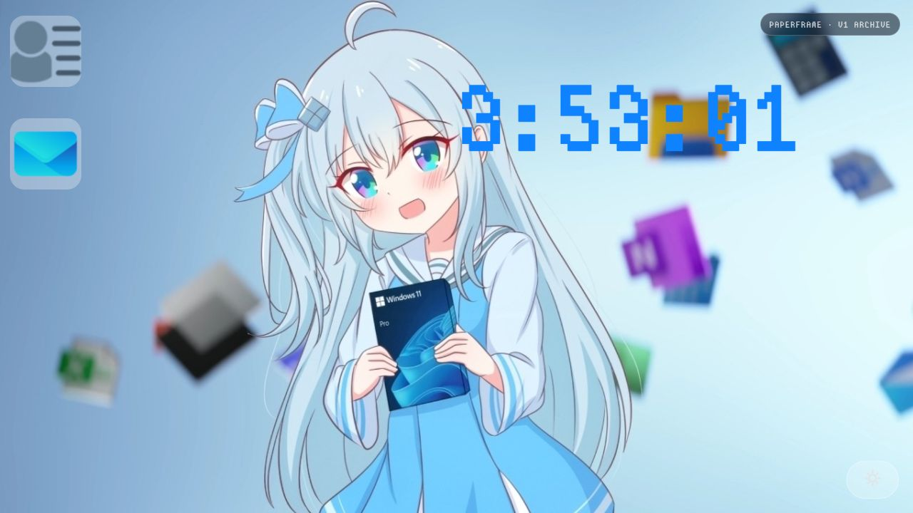

# PaperFrame Personal Website V1

纸帧（PaperFrame）的第一版个人网站。这个仓库保留项目最初的 Windows 桌面式布局，也是 [V2](https://github.com/YuBan834/paperframe-website-v2) 的起点。

## 页面内容

- Windows 风格桌面和可打开的信息窗口。
- 实时时钟、昼夜主题切换。
- 粒子连线背景与鼠标互动。
- 个人介绍、技术栈和联系入口。

## 本地查看

这是一个纯静态网站，没有构建步骤。直接打开 `index.html`，或用任意静态文件服务器访问仓库目录。

## 归档状态

V1 只保留和修复影响公开展示的问题，不再继续增加功能。原留言接口依赖本地 Node.js 服务，公开归档中已经停用，避免访问者把信息发往失效地址。

当前版本请查看 [PaperFrame Personal Website V2](https://github.com/YuBan834/paperframe-website-v2)。

## 素材说明

仓库中的图片、字体和其他展示素材不因源码公开而自动获得再授权。复用前请分别确认相应素材的许可。

Copyright © PaperFrame. All rights reserved.

